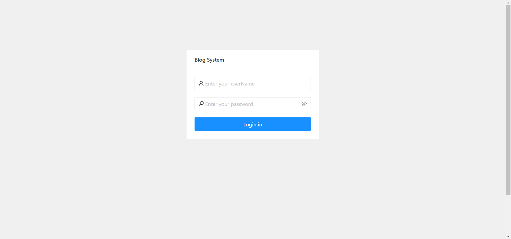
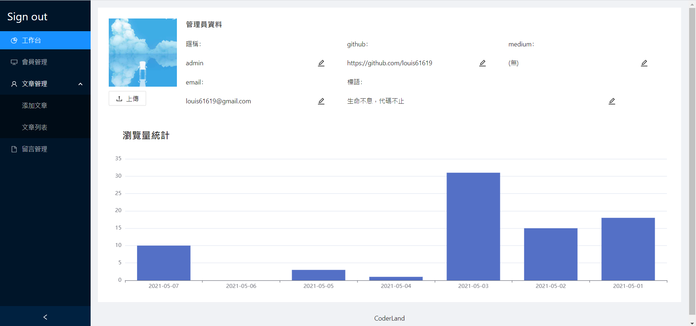
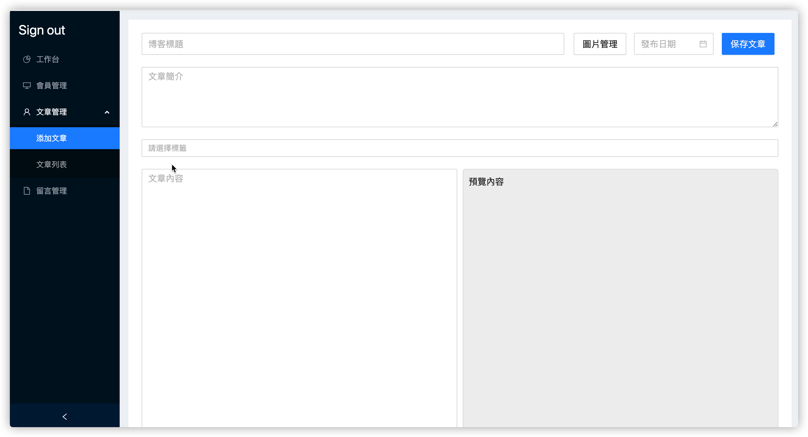
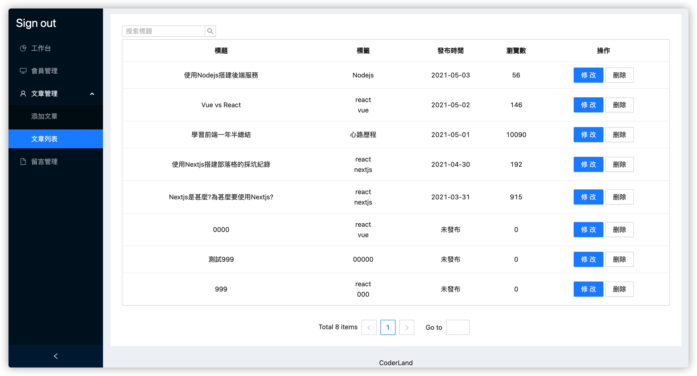
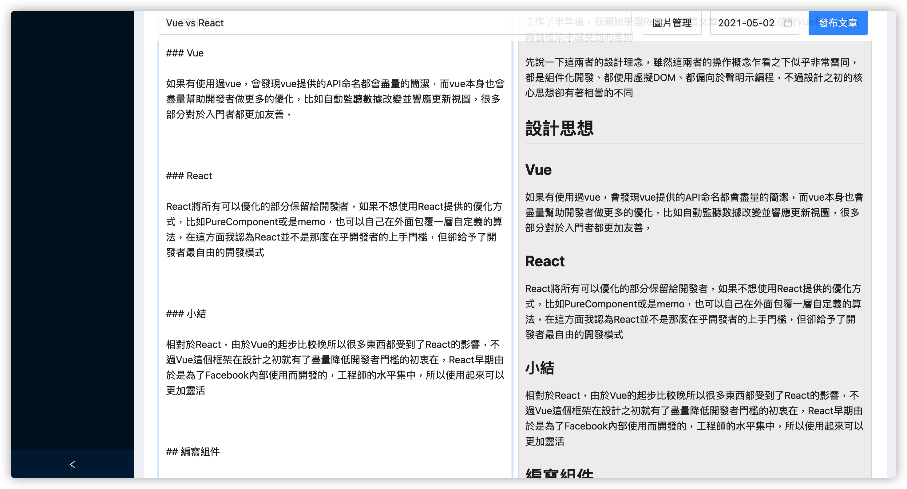
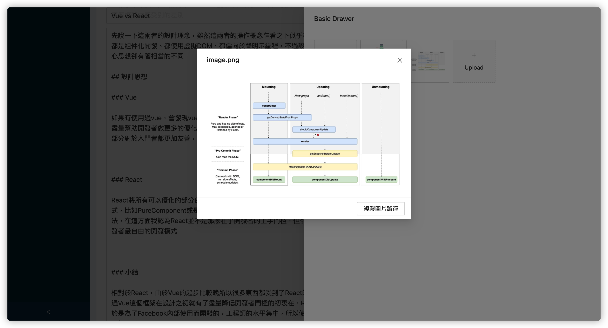
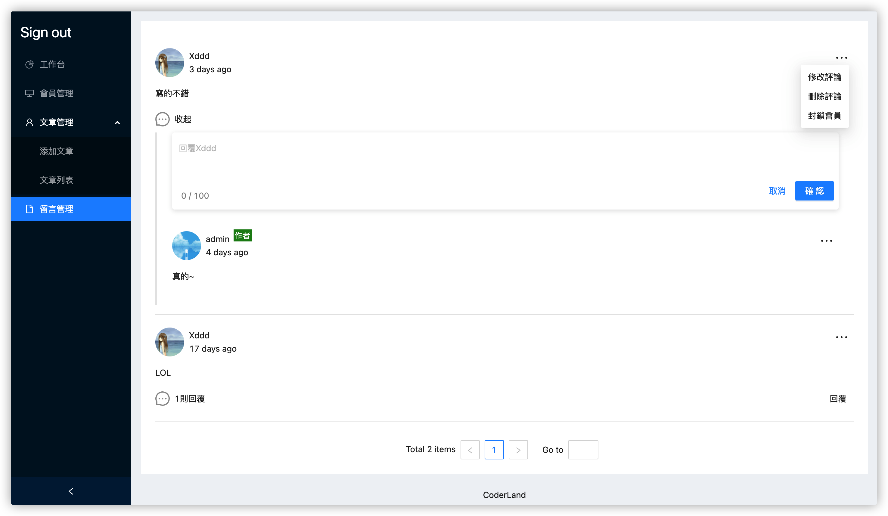

# 部落格後台

這是一個部落格練習項目

前台程式碼：https://github.com/louis61619/blog-frontstage.git

後台程式碼：https://github.com/louis61619/blog-backstage.git

服務端程式碼：https://github.com/louis61619/blog-server.git

## 使用技術

以下列出主要使用的框架和庫

- React
- React-router
- React-redux
- Immutable
- Echarts
- Ant-design
- Marked
- Styled-components
- Axios
- craco

## 開發環境搭建

- 下載 nodejs，nodejs 版本需大於 13
- 下載前後台和服務端程式碼，然後在各自的資料夾執行

```
npm i && npm run dev
```

- 資料庫使用 mysql，預設讀取端口為 3310

  - 匯入項目內的 blog-data-sample.sql 資料
  - 如遇到 `Client does not support authentication protocol requested by server;` 錯誤，可以參考：https://stackoverflow.com/questions/50093144/mysql-8-0-client-does-not-support-authentication-protocol-requested-by-server

## 環境變量

| Keys                 | Introduction |
| -------------------- | ------------ |
| REACT_APP_SERVER_URL | 服務端 URL   |
| REACT_APP_MARKDOWN_IMAGE_URL | 圖片地址前綴 |

## 功能

> 1.0

- 登錄



- 總覽

  - 修改管理員資料

  - 瀏覽量統計



- 會員管理
  - 黑名單(禁止留言)


- 文章管理
  - 添加文章
  - 文章列表
  - 搜索標題









- 留言管理
  - 刪除留言
  - 回覆留言


